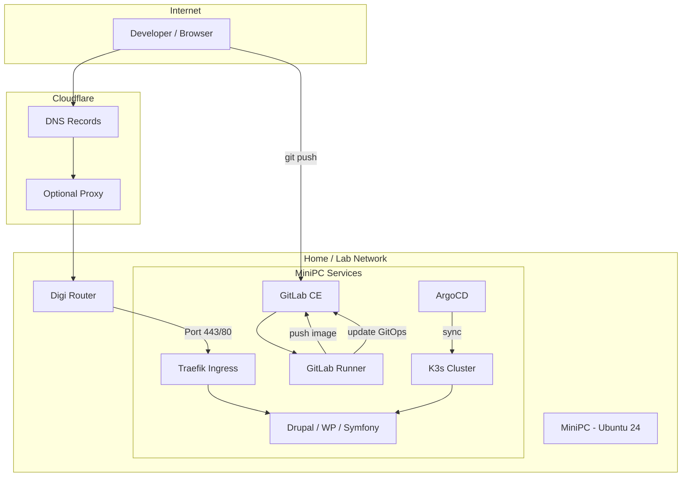

# Chapter 00 — Introduction

## Overview

This lab teaches CI/CD and GitOps by building real infrastructure on a MiniPC, then scaling out. You will run GitLab, a container registry, K3s, and ArgoCD on one machine first, deploy PHP-based sites (Drupal, WordPress, Symfony), and expose everything securely through Cloudflare.

## Goals

- Understand the full path from **git push** → **CI build** → **registry** → **ArgoCD sync** → **live site**
- Host multiple CMS/framework sites on one cluster with isolated namespaces
- Use the same patterns later for cheap production hosting
- Keep the dev environment reachable from outside via Cloudflare subdomains

## Final architecture

### Phase 1 — Single MiniPC (this guide's default)

```
Internet
   │
   ▼
Cloudflare (DNS + proxy/TLS edge)
   │
   ▼
Router (Digi) ── port forward ──► MiniPC #1
                                      │
                    ┌─────────────────┼─────────────────┐
                    │                 │                 │
                 GitLab CE      GitLab Runner         K3s
                 (+ Registry)    (Docker executor)   (+ Traefik)
                                                          │
                                                       ArgoCD
                                                          │
                              ┌───────────┬───────────────┼───────────┐
                              │           │               │           │
                           Drupal    WordPress        Symfony    (more sites)
```

### Phase 2 — Multi-node (chapter 23)

- MiniPC #1: K3s server (control plane) + GitLab
- MiniPC #2+: K3s agents (workers)
- Optional: HA control plane with embedded etcd or external datastore

### Traffic flow (HTTPS)

1. Browser → `https://drupal.<YOUR_DOMAIN>` → Cloudflare
2. Cloudflare → your public IP → Traefik (K3s ingress)
3. Traefik terminates TLS (Let's Encrypt cert via cert-manager + Cloudflare DNS-01)
4. Traefik routes to the Drupal Service in its namespace

### CI/CD flow

1. Developer pushes to GitLab
2. GitLab Runner builds Docker image, runs tests
3. Image pushed to GitLab Container Registry
4. Pipeline updates image tag in GitOps repo (or uses Argo CD Image Updater)
5. ArgoCD detects drift and syncs Kubernetes manifests
6. New pods roll out; Traefik serves updated app

## Subdomain plan (example)

Replace `<YOUR_DOMAIN>` with your Cloudflare domain:

| Subdomain | Service |
|-----------|---------|
| `gitlab.<YOUR_DOMAIN>` | GitLab CE |
| `registry.<YOUR_DOMAIN>` | Container Registry (often via GitLab) |
| `argo.<YOUR_DOMAIN>` | ArgoCD UI |
| `grafana.<YOUR_DOMAIN>` | Grafana (chapter 20) |
| `drupal.<YOUR_DOMAIN>` | Sample Drupal site |
| `wp.<YOUR_DOMAIN>` | Sample WordPress site |
| `symfony.<YOUR_DOMAIN>` | Sample Symfony app |

Add more subdomains per site as you onboard projects.

## Hardware requirements

### Minimum (single-node dev lab)

| Resource | Recommendation |
|----------|----------------|
| CPU | 4 cores (8 preferred) |
| RAM | 16 GB (32 GB if running many sites + GitLab) |
| Disk | 256 GB NVMe SSD (512 GB preferred) |
| Network | Gigabit Ethernet |
| OS | Ubuntu Server 24.04 LTS |

### Per additional worker (chapter 23)

| Resource | Recommendation |
|----------|----------------|
| CPU | 4+ cores |
| RAM | 8–16 GB |
| Disk | 128+ GB SSD |

### Why these specs

- **GitLab** is memory-hungry (~4 GB baseline)
- **K3s + apps** need headroom for MariaDB/PostgreSQL, Redis, and PHP-FPM pods
- **Registry images** accumulate quickly — plan disk space

## Software stack

| Layer | Choice | Why |
|-------|--------|-----|
| OS | Ubuntu 24.04 LTS | Long support, well documented |
| Containers | Docker + Compose | GitLab Runner executor, local builds |
| Orchestration | K3s | Lightweight Kubernetes, good for MiniPCs |
| Git / CI | GitLab CE + Runner | All-in-one git + CI + registry |
| CD | ArgoCD | GitOps, declarative deployments |
| Ingress | Traefik | K3s-friendly, Let's Encrypt support |
| TLS | cert-manager + Cloudflare DNS-01 | Wildcard certs for subdomains |
| Edge DNS | Cloudflare | Domain, DNS, optional proxy |
| ISP | Digi (Romania) | Fixed public IP verified — chapter 04 |

## Network diagram



## Chapter roadmap

| Phase | Chapters | Focus |
|-------|----------|-------|
| Foundation | 01–05 | OS, hardening, network, ISP, Cloudflare |
| Tooling | 06–07 | Docker, Git |
| CI platform | 08–10 | GitLab, Runner, Registry |
| Kubernetes & GitOps | 11–15 | K3s, ArgoCD, GitOps repo, Traefik, certs |
| Applications | 16–18 | Drupal, WordPress, Symfony |
| Operations | 19–24 | CI/CD, monitoring, backup, security, scaling, troubleshooting |

## Prerequisites

- MiniPC or spare hardware
- Internet via Digi (or adapt chapter 04 for your ISP)
- Cloudflare account (domain purchased in chapter 05)
- Basic Linux comfort (SSH, editing files with `nano`/`vim`)

## Verify

This is a planning chapter — no commands. Confirm you have:

- [ ] Hardware meeting minimum specs
- [ ] Cloudflare account ready (domain can wait until chapter 05)
- [ ] USB stick for Ubuntu installer
- [ ] Another machine for SSH access during setup

## Next

→ [Chapter 01 — Ubuntu 24 Installation](./01-ubuntu-24-installation.md)
